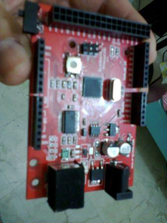
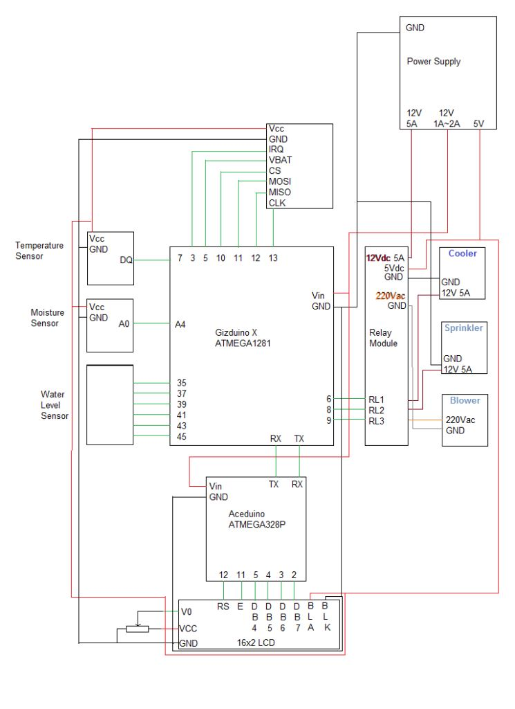
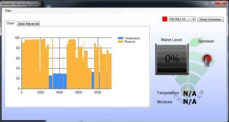
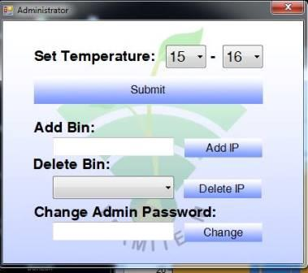
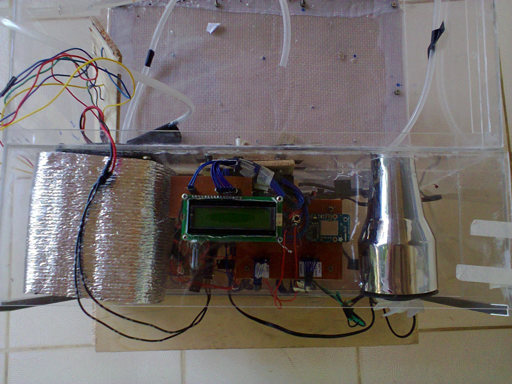
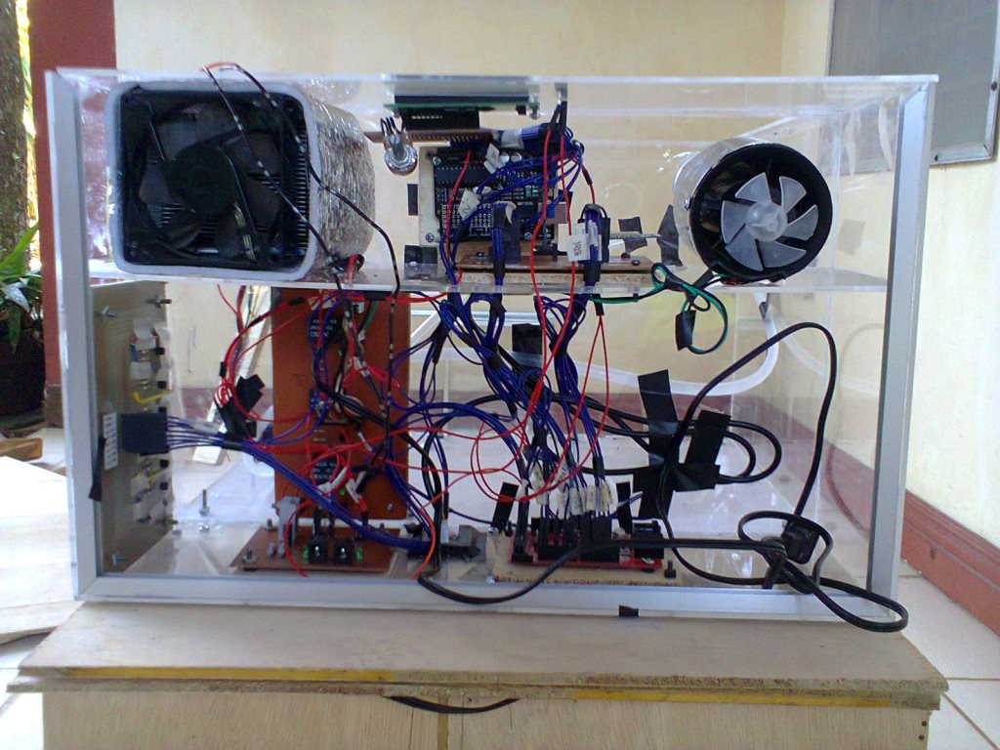
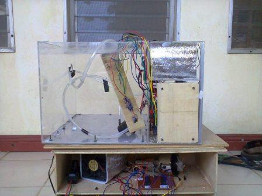
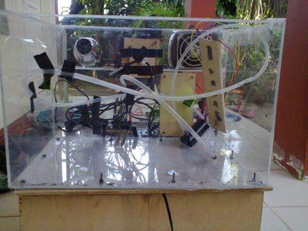
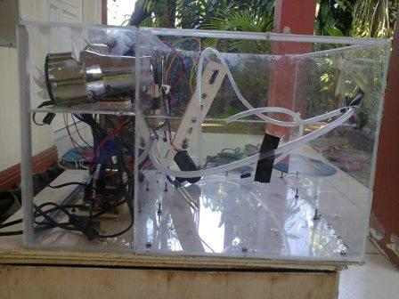
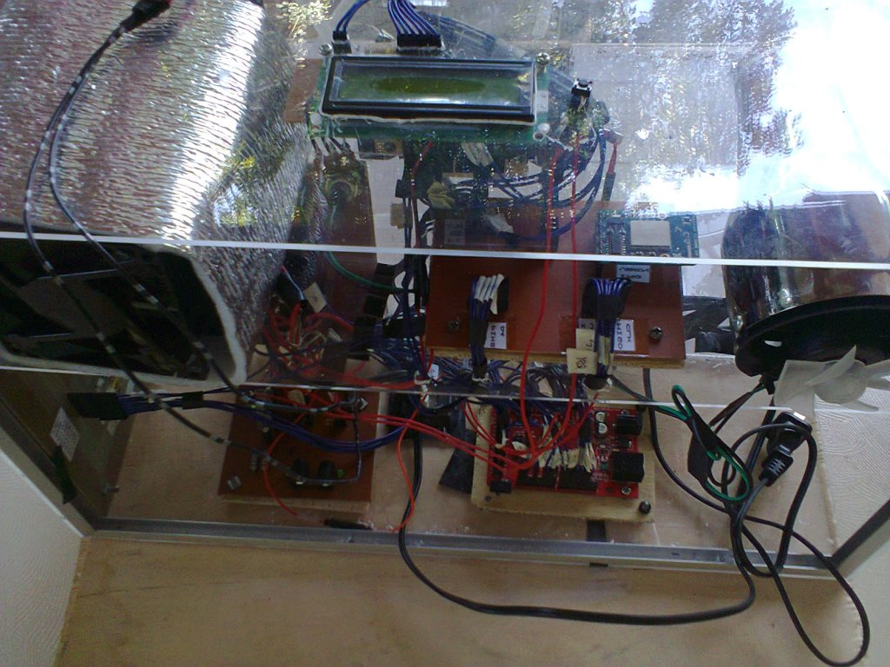

# Vermibin: Vermicomposting System (2014)

**Status:** *Archived / Legacy Project*
---
This repository serves as an archive for my 2014 college thesis, **"Vermibin."** It was an automated system designed to monitor and control the environment (temperature and soil moisture) for vermicomposting bins.

The project utilized an Arduino-based microcontroller to read sensors and wirelessly transmit data to a desktop application for logging and control.

## Project Features
* **Real-time Monitoring:** Tracks temperature and soil moisture levels.
* **Automated Control:** Automatically triggers heating, cooling, or sprinkler systems based on environmental thresholds.
* **Wireless Connectivity:** Uses Wi-Fi to transmit data from the hardware bin to a central server.
* **Desktop Interface:** A VB.NET application for data visualization, database logging, and manual overrides.

## The Team
* Ronilo Penero Jr.
* Rachel Anne Catequista
* Erylyn Joy Adrias
* Stephen Paul Jacildo

## Resources & Historical Links
* **Visual Basic Source Code:** [GitHub Repository](https://github.com/ronilopenero/Vermibin)
* **Development Challenges:** We encountered significant challenges with the Wi-Fi module back in 2014. You can read my [original forum post on Adafruit here](https://forums.adafruit.com/viewtopic.php?f=25&t=51273).

*This project is preserved for historical purposes and is unmaintained. The code has been left in its original state—except for an updated Wi-Fi password—to authentically represent what my code looked like during my college days in 2014.*

## Gallery

